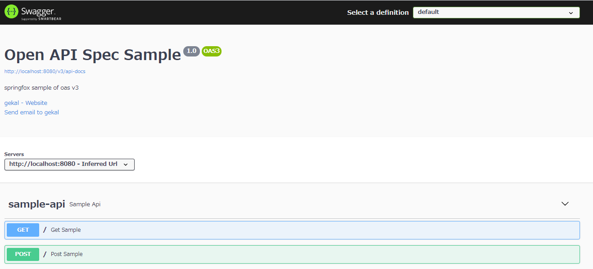

# SpringFoxのサンプル

## サンプル(V3)

### 依頼追加

```xml
<dependency>
    <groupId>io.springfox</groupId>
    <artifactId>springfox-boot-starter</artifactId>
    <version>3.0.0</version>
</dependency>
```

### Java Config

```java
package cn.gekal.sample.springfoxdemo;

import org.springframework.context.annotation.Bean;
import org.springframework.context.annotation.Configuration;
import springfox.documentation.builders.ApiInfoBuilder;
import springfox.documentation.builders.PathSelectors;
import springfox.documentation.builders.RequestHandlerSelectors;
import springfox.documentation.service.ApiInfo;
import springfox.documentation.service.Contact;
import springfox.documentation.spi.DocumentationType;
import springfox.documentation.spring.web.plugins.Docket;

@Configuration
public class OpenApiSpecConfig {

    @Bean
    public Docket createRestApi() {
        return new Docket(DocumentationType.OAS_30)
                .apiInfo(apiInfo())
                .select()
                .apis(RequestHandlerSelectors.basePackage("cn.gekal.sample.springfoxdemo"))
                // Controllerのアノテーションセレクト
                // .apis(RequestHandlerSelectors.withClassAnnotation(Api.class))
                // Operationのアノテーションセレクト
                // .apis(RequestHandlerSelectors.withMethodAnnotation(ApiOperation.class))
                .paths(PathSelectors.any())
                .build();
    }

    private ApiInfo apiInfo() {
        return new ApiInfoBuilder()
                .title("Open API Spec Sample")
                .description("springfox sample of oas v3")
                .contact(contact())
                .version("1.0")
                .build();
    }

    private Contact contact() {
        return new Contact("gekal", "https://example.com", "gekal@example.com");
    }
}
```

### サンプルAPI

```java
package cn.gekal.sample.springfoxdemo;

import io.swagger.annotations.ApiOperation;
import org.springframework.web.bind.annotation.GetMapping;
import org.springframework.web.bind.annotation.PostMapping;
import org.springframework.web.bind.annotation.RestController;

@RestController("/")
public class SampleApi {

    @ApiOperation("Get Sample")
    @GetMapping
    public String hello() {

        return "Get Sample";
    }

    @ApiOperation("Post Sample")
    @PostMapping
    public String postSample() {

        return "Post Sample";
    }
}
```

### サンプル実施

<http://localhost:8080/swagger-ui/index.html>




## 参照

1. [Springfox](https://github.com/springfox/springfox)
